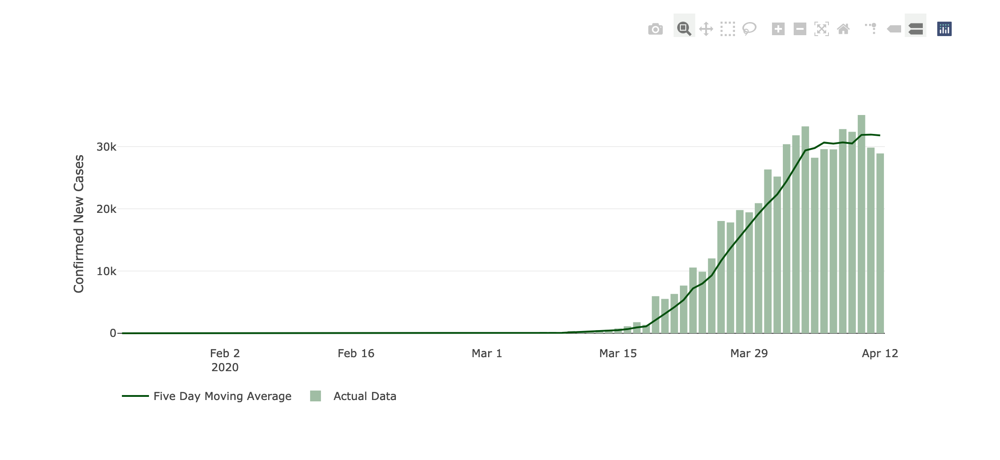
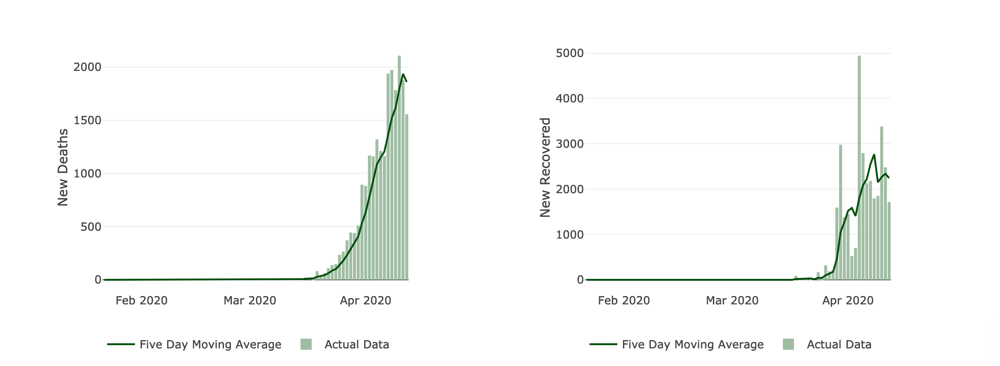
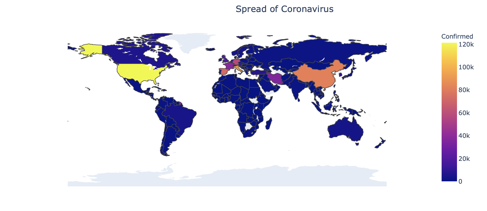
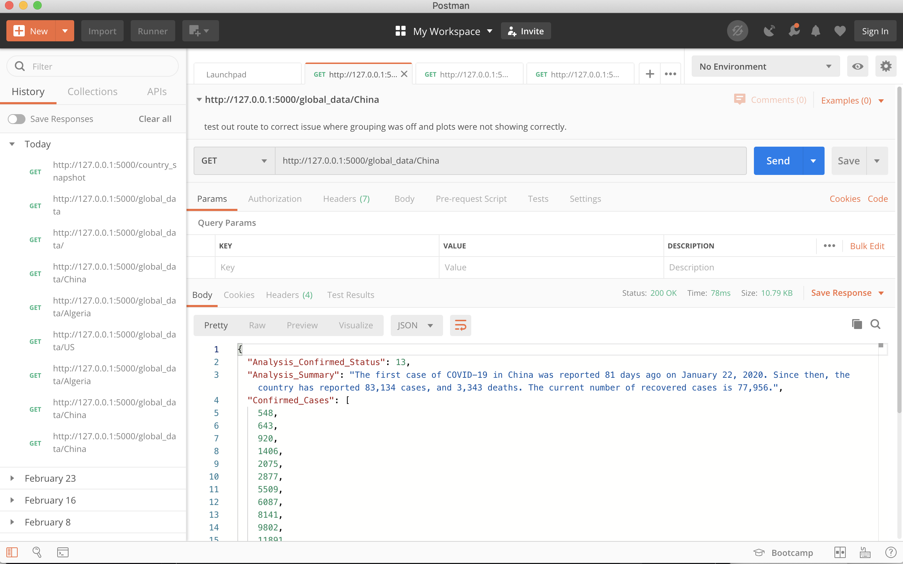
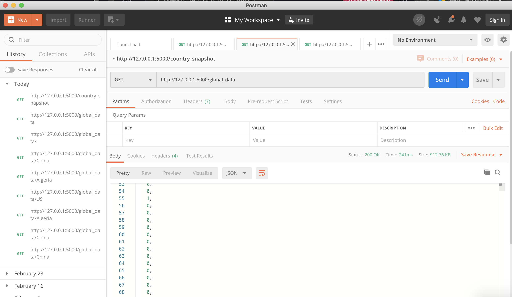
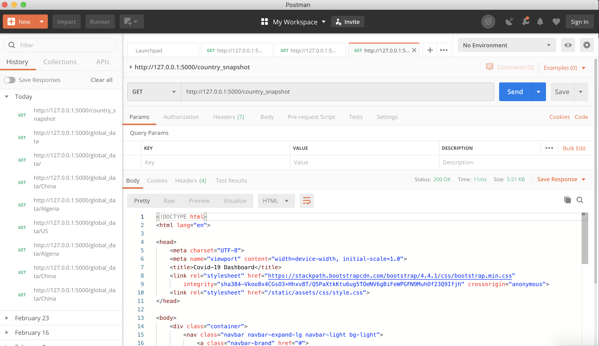

 

 ##  Covid-19 Visualization Dashboard

 Over the last few months Covid-19 has swept accross the globe. This project takes a look at some metrics to illustrate the impact and spread around the world. 

* * *

 ## Country Snapshot

 This app contains a country snapshot page which highlights three plots. One shows the trend of "flattening the curve" of new confirmed cases. Below is a snapshot of the United States.

 

Included in the country snapshot page, you will see two other plots highlighting the death and recovery trends.

 

* * *

 ## Enhancements

 There is currently a plot that illustrates the virus spread in an animated timeseries choropleth plot. A sample of the plot is illustrated below.

 

* * * 

## Route Testing

 Postman was utilized to test out the routes for each page. Below are a few snapshots of the testing.

 

##### Country Snapshot JSON Output testing
 

 

##### Global Data Testing
 

 

 ##### HTML Rendering Route Testing

  

 
